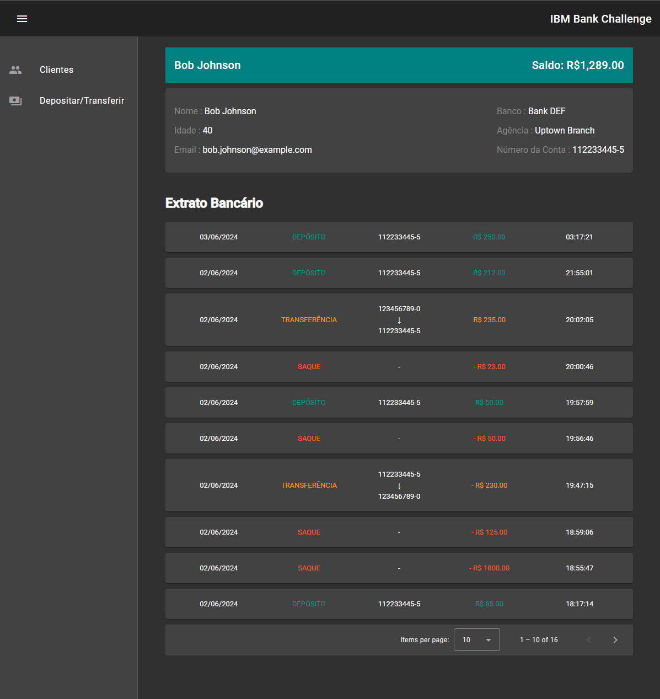

# Front-End of the IBM Challenge Project

## Description

This is the front-end project for the IBM Bank Challenge. The goal of this project is to provide an interactive user interface for the banking system, allowing users to perform operations such as transfers, deposits, and balance inquiries.



## Technologies Used

- Angular
- Angular Material
- TypeScript
- HTML
- CSS

## Prerequisites

Before starting, make sure you have Node.js installed on your machine. You can download Node.js [here](https://nodejs.org/).

This project was generated with [Angular CLI](https://github.com/angular/angular-cli) version 17.3.3.

## Installation

1. Clone the repository:

```bash
   git clone https://github.com/maxfortune93/ibm-_bank_challenge.git

   cd front-ibm-bank
```

2. Install the dependencies:

```bash
 npm install
```

## Running the Project

Run `ng serve` for a dev server. Navigate to `http://localhost:4200/`.

```bash
 ng serve
```

To run the project on a development server and connect it to the back-end, use the following command:

```bash
 npm start
```

## Contributions
Contributions are welcome! If you have any suggestions, improvements, or feedback about the project, feel free to share them. Your input is valuable and will help enhance the project.

